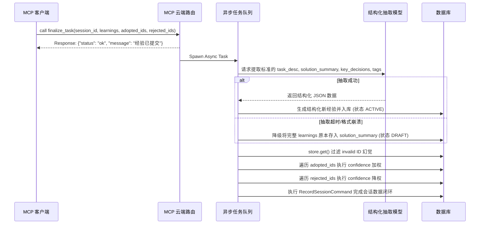

# 异步抽取与显式反馈机制

## 概述
为解决 MCP 工具 `finalize_task` 入参臃肿、大模型结构化抽取负担重以及执行链阻塞等问题，我们提出了一种全新的端侧极简参数+云端异步提取与显式反馈演化机制。该机制旨在释放 Agent 工作流性能，同时保障知识沉淀闭环的高保真和高容错率。

## 设计思路
1. **工具接口极致精简**：废弃大模型在客户端手动梳理 `task_description`, `solution_summary`, `key_decisions` 等复杂字段的结构。仅保留核心的 `session_id` 和一段非结构化的复盘文本 `learnings`。
2. **异步非阻塞执行（Fire and Forget）**：客户端提交极简数据后，MCP Server 立即返回 OK 响应，解除阻塞。
3. **后台智能重构（Async Extraction）**：服务端在后台异步任务中，通过内置 LLM 把客户端的自由复盘文本拆解为系统的标准经验结构入库。
4. **显式反馈替代隐式推断**：针对采纳率的计算，废弃原有的基于余弦相似度的自动推断，改为大模型显式地传入 `adopted_experience_ids` 和 `rejected_experience_ids` 以直接控制对应历史经验权重的升降。

## 实现细节
### 架构与异步流转
系统从“端侧重度结构化同步等待”彻底转变为“端侧极简出入参 + 云端异步解析流转”模式。



### 容错与兜底机制
* **提取失败降级兜底**：禁止后台任务因结构化模型提取格式错误抛出阻断异常。当遇到非标准 JSON 时，将整个 `learnings` 内容存入 `solution_summary` 并标记新经验为 `DRAFT` 或 `NEEDS_REVIEW` 态供人工干预。
* **无效 ID 幻觉静默过滤**：针对 Agent 在 ID 字段传入的幻觉字符串，反馈模块在权值计算前强校验是否存在该 ID，否则仅打印 Warning 并跳过执行，避免阻断剩余经验链路。
* **极简关键同步校验**：接收参数层对 `session_id` 与 `learnings` 空值进行直接拦截并打回至大模型端点。

## 接口与使用
**`finalize_task` 工具 Input Schema：**
```json
{
  "type": "object",
  "properties": {
    "session_id": {
      "type": "string",
      "description": "【必填】关联本次搜索会话的 ID"
    },
    "learnings": {
      "type": "string",
      "description": "【必填】大模型自由发挥的复盘文本，一句话或一段话总结学到了什么、怎么解决的、有什么坑"
    },
    "adopted_experience_ids": {
      "type": "array",
      "items": { "type": "string" },
      "description": "【选填】大模型明确采纳了哪几条历史经验的 ID"
    },
    "rejected_experience_ids": {
      "type": "array",
      "items": { "type": "string" },
      "description": "【选填】大模型明确哪些历史经验不仅没用，反而有坑"
    }
  },
  "required": ["session_id", "learnings"]
}
```

## 相关文件
- `docs/design/adr/ADR-001-implicit-evolution-architecture.md` - 相关的架构决策记录
- `src/server.py` - 需要重构 `finalize_task` 注册参数定义及响应返回流逻辑
- `src/application/handlers/infer_adoption_handler.py` - 需要废弃旧的相似度推断逻辑，替代为依据显式反馈 ID 的机制

---
**文档版本**: v1.0  
**最后更新**: 2026-04-03
